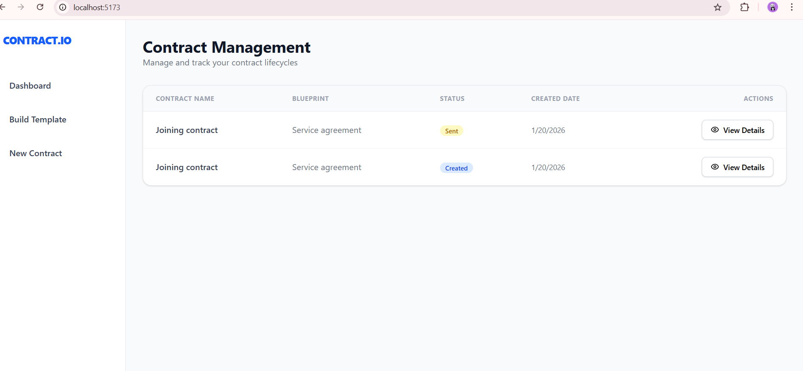
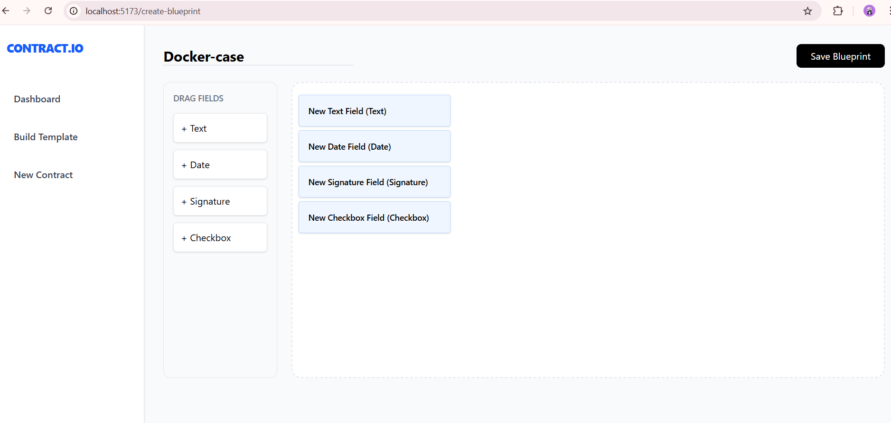
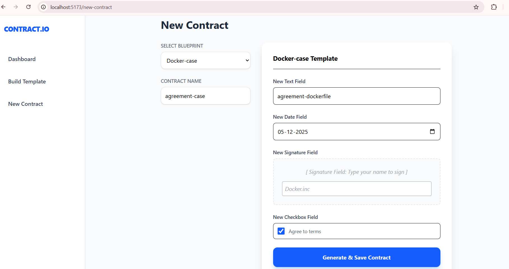

# 📄 Contract Management Application

Built with **⚛️ React** and **🎨 Tailwind CSS**

---

## 🚀 Project Overview

This application allows users to:

- Create **Contract Blueprints**
- Generate **Dynamic Contracts** from blueprints
- Manage contracts across multiple **lifecycle states**

It demonstrates:
- Component-driven architecture
- Dynamic form generation
- State management using **React Context API**

---

## 🧩 Technologies Used

- ⚛️ React  
- 🎨 Tailwind CSS  
- 🧠 Context API  
- 🧭 React Router  
- 🎥 Framer Motion  
- 📦 Vite  
- 🟨 JavaScript (ES6+)  

---

## 📥 Clone Repository

```bash
git clone https://github.com/your-username/contract-management.git
cd contract-management
📦 Install Dependencies & Run
npm install
npm run dev


📍 App runs at: http://localhost:5173

🎨 Tailwind CSS Setup (Vite)
npm install -D tailwindcss
npx tailwindcss init


Tailwind is configured directly with Vite for fast builds and zero runtime overhead.
📂 Folder Structure & Usage
src/context/AppContext.jsx

Centralized global state using React Context API.
Stores:

Blueprints

Contracts

Contract lifecycle statuses

src/features/blueprints/BlueprintEditor.jsx

Used to:

Create reusable blueprint templates

Define dynamic fields (Text, Date, Checkbox, Signature)

src/features/contracts/ContractCreator.jsx
Used to:

Select a blueprint

Enter contract name

Dynamically generate form fields

Save contracts based on blueprint structure

src/features/dashboard/Dashboard.jsx

Displays:

All contracts

Current lifecycle status

Summary dashboard view

src/App.jsx

Application entry point

Handles routing using React Router

Provides sidebar navigation
🧠 ContractCreator.jsx – Logic Explained
🔁 Dynamic Rendering

Blueprint fields are rendered using .map() on selectedBp.fields.
Any change in a blueprint automatically reflects in the contract form.

🧬 Inheritance

Each contract stores a copy of the blueprint fields, ensuring:

Existing contracts remain unchanged if a blueprint is edited later

Audit-safe contract history

🔐 State Isolation

Each field value is stored in formValues using unique field IDs, preventing collisions.

✨ Animations

Framer Motion is used for:

Smooth page transitions

Dynamic form rendering

Professional UI polish
🔒 Locked & Revoked Contract Logic
🔒 Locked Contracts

All inputs are disabled

No editing allowed

Contract becomes read-only

Ensures integrity after approval

❌ Revoked Contracts

Contract is visually marked as revoked

No further actions allowed

Used for compliance and audit safety
screenshots/
 ├── dashboard.png
 ├── blueprint.png
 └── contract.png
 ## 📸 App Preview

### 1. Centralized Dashboard
The main command center displaying all contracts with their respective blueprints and lifecycle statuses.
<p align="center">
  
</p>

---

### 2. Blueprint Builder (Template Creator)
An interactive workspace to define contract fields (Text, Date, Signature, Checkbox) with positioning metadata.
<p align="center">
  
</p>

---

### 3. Dynamic Contract Generation
The form engine that inherits fields from selected blueprints to generate live, fillable contracts.
<p align="center">
  
</p>
